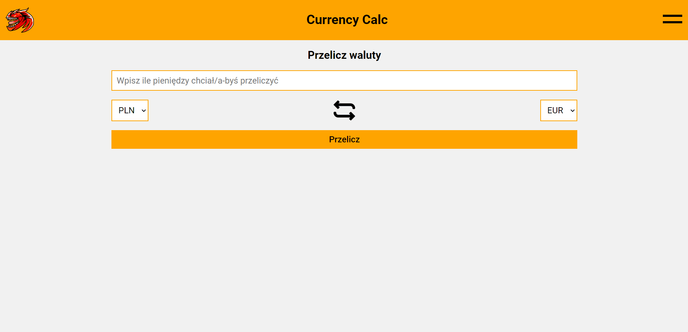

# Currency calc

## This is my own medium-advanced currency calculator

### DEMO: https://xtherexuu.github.io/currency-calc/

### Preview:

## Info

This calculator was made in react using create-react-app.

During using this calculator you can, calculate currencies.

In my app are four deafult currencies which is:

- Euro (EUR)
- U.S Dolar (USD)
- Polish Zloty (PLN)
- British Pound (GBP)

These currencies rates are fixed, this app doesn't connect with any API.

But in my app you can add yor own cuurrency, this currency will be saved in localStorage so if you don't clear browser memory you are not going to lose it, but your own currencies aren't saving on any server so, if you clear the browser memory you will lose all your castom currenicies.

My app have also dark mode which is also saving in localStorage, so if you go back on my site your previous theme will be loaded automaticly.
## Available Scripts

In the project directory, you can run:

### `npm start`

Runs the app in the development mode.\
Open [http://localhost:3000](http://localhost:3000) to view it in your browser.

The page will reload when you make changes.\
You may also see any lint errors in the console.
### `npm run build`

Builds the app for production to the `build` folder.\
It correctly bundles React in production mode and optimizes the build for the best performance.

The build is minified and the filenames include the hashes.\
Your app is ready to be deployed!

See the section about [deployment](https://facebook.github.io/create-react-app/docs/deployment) for more information.

### `npm run eject`

**Note: this is a one-way operation. Once you `eject`, you can't go back!**

If you aren't satisfied with the build tool and configuration choices, you can `eject` at any time. This command will remove the single build dependency from your project.

Instead, it will copy all the configuration files and the transitive dependencies (webpack, Babel, ESLint, etc) right into your project so you have full control over them. All of the commands except `eject` will still work, but they will point to the copied scripts so you can tweak them. At this point you're on your own.

You don't have to ever use `eject`. The curated feature set is suitable for small and middle deployments, and you shouldn't feel obligated to use this feature. However we understand that this tool wouldn't be useful if you couldn't customize it when you are ready for it.